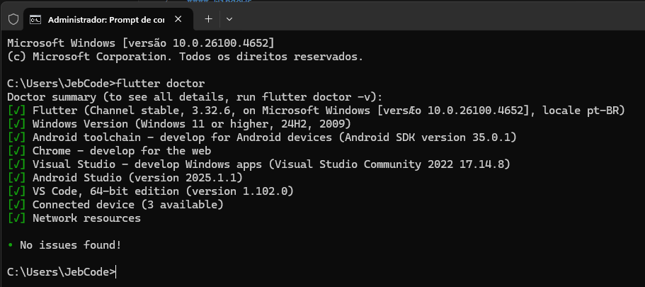

# EBAC - Curso Flutter do Zero ao Pro
## Módulo 2 - Ambiente de Desenvolvimento

### 📱 Sobre o Módulo
Neste módulo, aprendemos sobre a configuração do ambiente de desenvolvimento Flutter, incluindo:

#### Windows
- Ferramentas necessárias para Windows
- Sites oficiais para instalação
- Configuração do Flutter no Windows

#### MacOS
- Ferramentas necessárias para Mac
- Sites oficiais para instalação
- Configuração do Flutter no MacOS

### 🎯 Desafio
O aluno deverá:
1. Configurar o ambiente de desenvolvimento Flutter
2. Executar o comando `flutter doctor` no Terminal/CMD
3. Capturar a tela com o resultado do comando
4. Documentar quaisquer problemas encontrados e suas soluções

### ✍️ Instruções
1. Instale todas as ferramentas necessárias
2. Configure as variáveis de ambiente
3. Execute o comando `flutter doctor`
4. Faça um screenshot do resultado
5. Corrija eventuais problemas indicados pelo doctor

### 📸 Evidência de Configuração

### 📝 Formato de Entrega
- Screenshot do resultado do `flutter doctor`
- Documento descrevendo problemas encontrados (se houver)
- Soluções aplicadas para resolver os problemas

### 📚 Recursos Adicionais
- [Flutter Install Windows](https://docs.flutter.dev/get-started/install/windows)
- [Flutter Install MacOS](https://docs.flutter.dev/get-started/install/macos)
- [Flutter Doctor Documentation](https://docs.flutter.dev/reference/flutter-cli#flutter-doctor)

### 🔍 Critérios de Avaliação
- Ambiente configurado corretamente
- Todas as dependências instaladas
- Problemas resolvidos
- Documentação clara das soluções

### 👨‍💻 Autor
Jonathan Euzébio Boza

---
Desenvolvido como parte do curso Flutter do Zero ao Pro - EBAC
